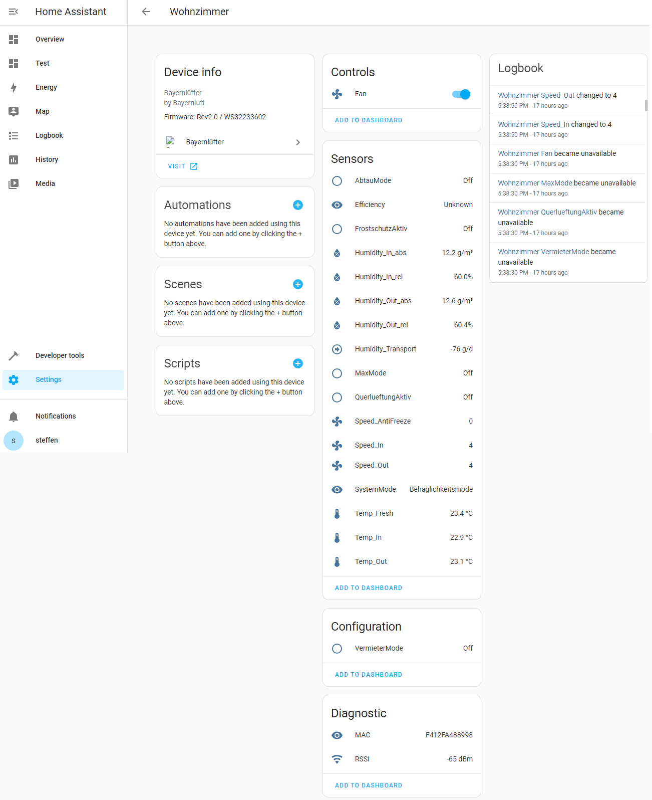
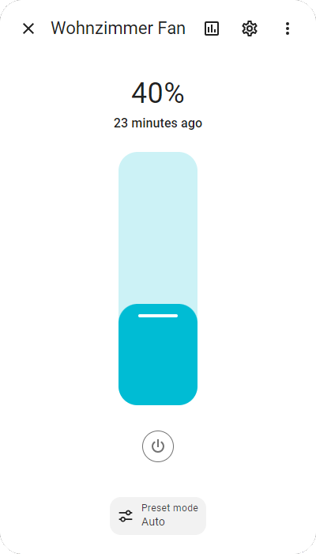

# Bayernlüfter

This component adds support for [Bayernlüfter](https://www.bayernluft.de) devices to Home Assistant:

If you like this component, please give it a star on [github](https://github.com/mampfes/ha_bayernluefter).

## Installation

1. Ensure that [HACS](https://hacs.xyz) is installed.
2. Install **Bayernlüfter** integration via HACS.
3. Add **Bayernlüfter** integration to Home Assistant (one per device):

   

In case you would like to install manually:

1. Copy the folder `custom_components/bayernluefter` to `custom_components` in your Home Assistant `config` folder.
2. Add **Bayernlüfter** integration to Home Assistant (one per device):

   

## Template File

To get all available values from your Bayernlüfter device, you have to upload a template file with all available variables:

1. Download the following [template](./doc/export.txt).
2. Open the *Experten-Browser* of your device: `http://<ip-address/browser.html`
3. Select the downloaded `export.txt` in the *Experten-Browser* and click on *Hochladen*.

## Device Name

By factory default, the device name is equal to the MAC address of the device. To set your own device name:

1. Open *WLAN Konfiguration* of your device: `http://<ip-address/ipconfig.html`
2. In the box *Modulkonfiguration* change the field `DeviceName`.
3. Click on *Speichern und neu starten*.

# Acknowledgements

This component was inspired by <https://github.com/nielstron/ha_bayernluefter>.
